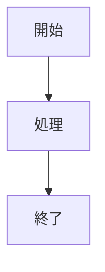

# GitHub Issue テンプレート

## 概要
このディレクトリには、各エージェントが自動生成するIssueのテンプレートが含まれています。
各テンプレートはLLM強化されたエージェントの出力に最適化されており、人間が読みやすい形式で情報を整理します。

## テンプレート一覧

### 1. 🎯 Planner - 戦略分析
- **ファイル**: `01_planner_strategy_analysis.md`
- **用途**: 競技選択とメダル確率分析
- **主要セクション**:
  - 競技基本情報
  - LLM多段階メダル確率分析
  - 戦略的推奨事項
  - リスク評価
  - 次エージェントへの引き継ぎ

### 2. 🔬 Analyzer - 技術分析
- **ファイル**: `02_analyzer_technical_analysis.md`
- **用途**: 技術深層分析とソリューション設計
- **主要セクション**:
  - グランドマスターソリューション抽出
  - 実装ROI評価
  - 統合ソリューション設計
  - 実装推奨事項
  - 評価戦略

### 3. ⚡ Executor - 実装実行
- **ファイル**: `03_executor_implementation_report.md`
- **用途**: 実装進捗と実験管理
- **主要セクション**:
  - LLM提出戦略分析
  - 実装進捗
  - 実験結果サマリー
  - パフォーマンス指標
  - 次の戦略

### 4. 🔍 Monitor - システム監視
- **ファイル**: `04_monitor_system_health.md`
- **用途**: 予防的監視と自動修復
- **主要セクション**:
  - 3段階LLM予防的監視分析
  - システムメトリクス
  - 予測分析
  - アラート・対応履歴
  - 改善提案

### 5. 📚 Retrospective - 振り返り学習
- **ファイル**: `05_retrospective_learning_report.md`
- **用途**: 学習抽出とシステム改善
- **主要セクション**:
  - 4段階学習分析
  - エージェント別パフォーマンス
  - 知識ベース更新
  - システム改善実装
  - 次回への準備

## テンプレート変数

各テンプレートは`{{VARIABLE_NAME}}`形式の変数を使用します。
エージェントはこれらの変数を実際の値に置き換えてIssueを生成します。

### 共通変数
- `{{COMPETITION_ID}}`: 競技ID
- `{{COMPETITION_TITLE}}`: 競技タイトル
- `{{TIMESTAMP}}`: タイムスタンプ
- `{{AGENT_VERSION}}`: エージェントバージョン

### 特殊要素

#### テーブル
```markdown
| ヘッダー1 | ヘッダー2 | ヘッダー3 |
|----------|----------|----------|
| {{VAR_1}} | {{VAR_2}} | {{VAR_3}} |
```

#### Mermaidダイアグラム


#### プログレスバー
```
進捗: {{PROGRESS}}% [████████░░] 
```

## カスタマイズ

### 新しいテンプレートの追加
1. `.github/ISSUE_TEMPLATE/`に新しい`.md`ファイルを作成
2. フロントマターを追加:
   ```yaml
   ---
   name: テンプレート名
   about: テンプレートの説明
   title: デフォルトタイトル
   labels: 適用するラベル
   assignees: ''
   ---
   ```
3. マークダウンでテンプレート本文を記述

### 既存テンプレートの修正
各テンプレートは独立したマークダウンファイルなので、直接編集可能です。
変更は即座に反映されます。

## ベストプラクティス

1. **可読性優先**: 人間が一目で理解できる構造を維持
2. **情報の階層化**: 重要な情報を上部に、詳細を下部に配置
3. **視覚的要素**: テーブル、リスト、ダイアグラムを活用
4. **リンク活用**: 関連Issue間のリンクを明確に
5. **メタデータ記録**: 分析の深さ、処理時間、LLM使用状況を記録

## メンテナンス

- テンプレートは定期的にレビューし、エージェントの進化に合わせて更新
- 使用頻度の低い変数は削除し、新しい要求に応じて変数を追加
- フィードバックに基づいて継続的に改善