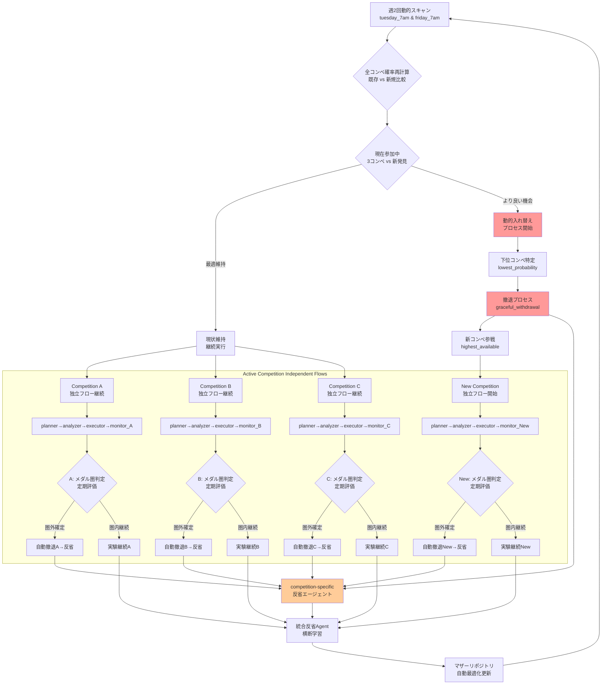

# Kaggle Claude Mother

**🏆 Kaggleメダル獲得最優先** のためのグランドマスター級攻略システム。Claude Codeを活用し、戦略的コンペ選択から高度技術実装まで、メダル獲得に必要な全要素を統合した戦略的マザーリポジトリです。

グランドマスター事例（Owen Zhang、Abhishek Thakur等）の成功要因を分析し、**「金メダル1個 > 銀メダル2個」**の原則に基づく戦略的アプローチを実装。平均2年かかるグランドマスター到達を大幅短縮することを目標とします。

## 🎯 メダル獲得戦略の核心

- **🔍 戦略的コンペ選択**: メダル獲得確率の定量評価による最適選択
- **🧠 グランドマスター級技術**: cuML/GPU最適化アンサンブル・スタッキング
- **📚 継続学習システム**: 失敗分析→知識蓄積→次戦略最適化
- **⚡ 統合エージェント連携**: 4エージェントによる同時並行・継続フロー

## 🤖 自動化メダル獲得システム

### 自動実行アーキテクチャ概要
システムは**人間介入を最小化**し、自律的にメダル獲得に向けて動作します。実装手段（shell/Python/GitHub Actions等）は要検討、設計思想が核心です。

### Stage 1: 動的コンペ管理・最適化参戦（最大3コンペ同時進行）
```yaml
# 週2回の動的最適化実行
dynamic_competition_manager:
  trigger: schedule(tuesday_7am, friday_7am)  # 週2回の最適化チェック
  process:
    - scan_active_competitions()
    - calculate_medal_probability(participants, prize, domain_match)
    - compare_with_current_competitions(running_competitions)
    - identify_optimal_portfolio(max_concurrent: 3)
    
    # 動的入れ替えロジック
    - if_better_opportunity_found():
        - rank_all_competitions_by_probability()
        - trigger_withdrawal_process(lowest_probability_competition)
        - auto_initialize_new_competition_workspace()
        - transfer_cross_competition_learnings()
    
    - maintain_top3_competitions(threshold_score > 0.7)
    - trigger_independent_agent_flow_per_competition()
```

### Stage 2-3: 各コンペ独立エージェント実行
```yaml
# 各コンペごとに独立したエージェント連携（最大3コンペ並行）
per_competition_orchestration:
  competition_instance: "{competition_name}"
  
  planner_agent:
    trigger: competition_selected
    scope: single_competition
    auto_actions:
      - create_strategy_issue(competition_specific)
      - analyze_medal_probability(independent)
      - notify_analyzer_agent(same_competition)
      
  analyzer_agent:
    trigger: strategy_issue_created
    scope: single_competition
    auto_actions:
      - deep_dive_grandmaster_solutions(competition_focused)
      - research_latest_techniques(domain_specific)
      - update_technical_feasibility(isolated)
      - notify_executor_agent(same_competition)
      
  executor_agent:
    trigger: analysis_completed
    scope: single_competition
    auto_actions:
      - setup_cuml_gpu_environment(dedicated_resources)
      - implement_owen_zhang_methods(competition_tailored)
      - run_parallel_experiments(isolated_workspace)
      - report_scores_realtime(competition_specific)
      
  monitor_agent:
    trigger: continuous
    scope: single_competition
    auto_actions:
      - analyze_experiment_failures(competition_focused)
      - accumulate_knowledge_base(cross_competition_learning)
      - optimize_strategy_realtime(independent_optimization)

# 動的撤退・入れ替えプロセス
dynamic_replacement_system:
  trigger: better_opportunity_identified_by_stage1
  
  withdrawal_orchestration:
    target_competition: lowest_medal_probability
    auto_actions:
      - analyze_current_standing(final_medal_probability_assessment)
      - execute_graceful_withdrawal(save_experiment_logs, extract_key_learnings)
      - trigger_retrospective_agent(competition_specific_analysis)
      - clean_allocated_resources(gpu_memory, workspace, dependencies)
      - notify_portfolio_rebalancing(competition_slot_available)
      
  replacement_orchestration:
    new_competition: highest_available_probability
    auto_actions:
      - initialize_new_competition_workspace(dedicated_setup)
      - transfer_applicable_knowledge(cross_competition_patterns)
      - start_independent_agent_flow(planner→analyzer→executor→monitor)
      - integrate_portfolio_monitoring(unified_tracking)
```

### Stage 4: 自動学習・次戦略最適化
```yaml
# 継続改善自動サイクル  
continuous_learning:
  trigger: competition_ended_or_withdrawal
  auto_process:
    - analyze_medal_result(success/failure/withdrawal)
    - extract_success_failure_patterns()
    - update_probability_calculation_model()
    - optimize_next_competition_selection()
    - trigger_retrospective_agent()
    - auto_start_next_cycle()
```

### Stage 5: システム自己改善【反省エージェント】
```yaml
# マザーリポジトリ自動改善
retrospective_agent:
  trigger: competition_ended_or_withdrawal_decision
  auto_actions:
    - analyze_agent_collaboration_bottlenecks()
    - identify_code_optimization_opportunities()
    - evaluate_strategy_algorithm_effectiveness()
    - auto_update_mother_repository_code()
    - improve_agent_coordination_logic()
    - optimize_technical_approach_templates()
    - enhance_medal_probability_calculation()
  deliverables:
    - updated_agent_scripts()
    - improved_coordination_algorithms()
    - enhanced_strategy_templates()
    - optimized_technical_configurations()
```

### 人間介入ポイント（完全最小化）
- **システム起動**: 初回起動・認証設定のみ
- **以降完全自動**: 戦略判断・撤退決定・システム改善まで全自動化

## ディレクトリ構造

```
kaggle-claude-mother/                 # マザーリポジトリ（コマンド・テンプレート管理）
├── .claude/
│   └── commands/                     # Claude Codeカスタムコマンド
│       ├── find-comp.md              # コンペ検索・提案
│       ├── start.md                  # リポジトリ作成＋初期分析
│       └── update-insights.md        # Discussion更新チェック
├── templates/                        # コンペ用テンプレート
│   ├── notebooks/                    # 分析ノートブック雛形
│   └── pyproject.toml.template       # uv設定テンプレート
└── competitions/                     # 各コンペの作業ディレクトリ
    ├── titanic/                      # 例：タイタニックコンペ
    │   ├── pyproject.toml            # 個別のuv環境
    │   ├── .venv/                    # コンペ専用仮想環境
    │   ├── notebooks/
    │   ├── data/
    │   └── insights/
    └── house-prices/                 # 例：住宅価格予測コンペ
        ├── pyproject.toml
        ├── .venv/
        └── ...
```

## 🚀 完全自動化セットアップ

**人間の作業は初回認証のみ** - 以降は全自動でメダル獲得まで動作します。

### 一回限りの初期設定
```bash
# 1. マザーリポジトリのクローン
ghq get your-username/kaggle-claude-mother
cd $(ghq root)/github.com/your-username/kaggle-claude-mother

# 2. 認証設定（一回のみ）
mkdir -p ~/.kaggle
cp kaggle.json ~/.kaggle/  # Kaggle API認証
chmod 600 ~/.kaggle/kaggle.json
gh auth login  # GitHub API認証（Issue操作用）

# 3. 自動化システム起動
./start_autonomous_system.sh  # 完全自動化開始
```

### 完全自動動作開始後（週2回動的最適化・最大3コンペ並行）
システムが以下を**人間介入なし**で実行：
- ✅ **週2回（火・金）動的コンペスキャン**・メダル確率再評価・最適3コンペ維持
- ✅ **自動入れ替え**：より良いコンペ発見時の下位コンペ撤退・新コンペ参戦
- ✅ 各コンペ独立の自動環境構築（uv + cuML/GPU + 専用ライブラリ）
- ✅ コンペ特化グランドマスター解法調査・独立実装・並行実験・個別提出
- ✅ コンペ個別失敗学習・横断知識共有・独立戦略最適化・統合システム改善
- ✅ **動的撤退**：メダル圏外確定 or より良い機会発見時の即座撤退・反省
- ✅ 成功時の知識蓄積・全コンペ横断学習・次戦略向上

**人間は結果通知を受けるのみ** - システムが常に最高確率3コンペで自律的にメダル獲得を目指します。

## 提出方式

**単一ノートブック提出**が標準的な方式です。Kaggleコンペでは1つのノートブックで全ての処理（EDA、前処理、モデリング、予測）を完結させます。

```bash
# 各コンペディレクトリに移動して実行
cd competitions/competition-name
uv run kaggle kernels push -p ./notebooks/submission.ipynb
```

**重要**: 全ての作業（データ分析、モデル訓練、提出）は対応するコンペディレクトリ内で実行してください。

## 共通コードブロック

再利用可能なコードブロックは`templates/`ディレクトリに配置され、新しいコンペ作成時に各コンペディレクトリにコピーされます。

## エージェント間連携システム（GitHub Issue API）

ファイルベースではなく**GitHub Issueベース**でエージェント間のやり取りを行います：

### 統合エージェント構成（メダル獲得最優先強化版）

#### 1. 戦略プランニングエージェント (`agent:planner`) 【強化版】
- **主要責務**: 戦略的コンペ選択・全体戦略策定・自動撤退判断
- **自動実行内容**:
  - **🎯 メダル獲得確率算出**: 参加者数×賞金×専門性マッチング→定量スコア
  - **🏆 戦略的選択**: 「金メダル1個>銀メダル2個」原則による最適コンペ選択
  - **⚡ 自動撤退判断**: 中間順位分析→メダル圏外確定時の早期撤退決定
- **Issue作成例**: "Strategic Selection: Medal Probability 0.73 - [Competition]"

#### 2. 深層分析エージェント (`agent:analyzer`) 【強化版】
- **主要責務**: グランドマスター級技術調査・最新手法研究・競合分析
- **自動実行内容**:
  - **🔬 上位解法深掘り**: Owen Zhang/Abhishek Thakur級解法の技術分析・再現
  - **📚 最新手法調査**: arXiv論文+Kaggle優勝解法の自動収集・実装可能性評価
  - **⚖️ 技術ベンチマーク**: 手法別性能比較・GPU最適化要件分析
- **Issue作成例**: "Technical Deep Dive: XGBoost+cuML Stacking Analysis"

#### 3. 高度実行エージェント (`agent:executor`) 【強化版】  
- **主要責務**: グランドマスター級技術実装・GPU最適化・高速イテレーション
- **自動実行内容**:
  - **🏗️ cuML/GPU最適化**: 大規模アンサンブル・スタッキングの並列実行
  - **⚙️ Owen Zhang式FE**: 手動特徴量エンジニアリング+自動化のハイブリッド
  - **🚀 高速実験**: 複数モデルの同時並行訓練・リアルタイムスコア監視
- **Issue更新**: 実験結果・CV/LBスコア・技術的課題をリアルタイム報告

#### 4. 学習モニタリングエージェント (`agent:monitor`) 【強化版】
- **主要責務**: 継続学習・失敗分析・戦略リアルタイム最適化
- **自動実行内容**:
  - **🧠 失敗学習**: 実験失敗・スコア低下の要因構造化分析
  - **📈 知識蓄積**: 成功・失敗パターンのデータベース化・次回転移
  - **🔄 動的最適化**: 中間結果に基づく戦略・手法のリアルタイム調整
- **自動化機能**: 全エージェント監視・ボトルネック特定・改善指示

#### 5. 反省エージェント (`agent:retrospective`) 【新規】
- **主要責務**: システム自己改善・マザーリポジトリ自動更新
- **自動実行内容**:
  - **🔧 システム改善**: エージェント連携・コード・戦略アルゴリズムの最適化
  - **📊 効果分析**: 確率算出モデル・技術選択・タイミング判断の精度向上
  - **⚡ 自動コード更新**: templates/・commands/・連携ロジックの改良実装
- **成果物**: 改善されたマザーリポジトリ・次世代エージェント・最適化戦略

### ラベル体系（強化版）
- `agent:planner` - 戦略プランニングエージェント
- `agent:analyzer` - 深層分析エージェント  
- `agent:executor` - 高度実行エージェント
- `agent:monitor` - 学習モニタリングエージェント
- `agent:retrospective` - 反省エージェント（新規）
- `status:auto-processing` - 自動処理中
- `status:completed` - 完了
- `priority:medal-critical` - メダル獲得に直結
- `medal-probability:high/medium/low` - メダル確率評価

### 完全自動連携フロー（各コンペ独立実行）

#### 🔄 動的コンペ管理・最適化アーキテクチャ



#### 📋 動的最適化実行フロー詳細
1. **週2回動的スキャン** → 全コンペ確率再計算・既存参加コンペとの比較評価
2. **動的入れ替え判断** → より高確率コンペ発見時の自動入れ替えプロセス起動
3. **戦略プランニング** → 各コンペ独立の確率算出・戦略Issue作成
4. **深層分析** → コンペ特化グランドマスター解法調査・技術実装判断
5. **高度実行** → 専用GPU環境・コンペ特化実験・独立スコア報告
6. **学習モニタリング** → コンペ個別失敗分析・横断知識蓄積・独立最適化
7. **自動撤退判断** → メダル圏外確定 or より良い機会発見時の即座撤退
8. **動的リソース最適化** → 撤退コンペのリソース解放・新コンペへの再配分
9. **統合反省・改善** → 全コンペ結果統合分析・マザーリポジトリ自動更新
10. **完全自動サイクル** → 改善反映後、次の動的最適化・継続実行

## カスタムコマンド詳細

> **注意**: 
> - `k_`で始まる単語（例：`k_init`、`k_start`等）は、このリポジトリ専用のカスタムスラッシュコマンドを指します。
> - `k_init`作業中はweb検索は必要ありません。

### `/find-comp`

- アクティブなコンペを取得
- メダル獲得可能性、参加者数、賞金を分析
- おすすめ度をスコアリングして提示

### `/start [competition-name]`

- `competitions/[competition-name]/`ディレクトリ作成
- テンプレートからの初期ファイル配置
- データダウンロード
- Discussion分析（上位投稿、有用な手法を抽出）
- 初期EDA自動実行

### `/update-insights`

- 前回チェック以降の新規Discussionを分析
- 各コンペの`insights/`ディレクトリに知見を追記
- 重要な更新があれば通知

## Discussion分析機能

各コンペのDiscussionから以下を自動抽出：

- 高評価の解法アプローチ
- 有効な特徴量エンジニアリング
- バグ情報・注意点

キャッシュ戦略：

- 初回実行時：全Discussion取得
- 2回目以降：差分のみ取得（各コンペの`cache/discussions/last_check.json`）

## リポジトリ管理方針

**マルチリポジトリ管理**: 各コンペは独立したGitリポジトリとして管理されます。マザーリポジトリとは別の個別リポジトリです。

各コンペは`competitions/`ディレクトリ以下で管理され、以下の構造に従います：

```
competitions/[competition-name]/
├── pyproject.toml           # uv設定（コンペ専用依存関係）
├── .venv/                   # 仮想環境（個別管理）
├── notebooks/
│   └── submission.ipynb     # 提出用の単一ノートブック
├── data/                    # ダウンロードしたデータセット
├── insights/
│   └── discussion_summary.md # 抽出された知見
└── cache/
    └── discussions/         # Discussion分析キャッシュ
```

**管理方針:**
- 各コンペは`competitions/`以下で独立したGitリポジトリとして管理
- コンペごとに独立したuv環境を構築
- マザーリポジトリ、各コンペリポジトリは完全に分離
- **重要**: マザーリポジトリ直下にはコンペデータやモデルファイルは置かない
- テンプレートとカスタムコマンドのみをマザーで管理