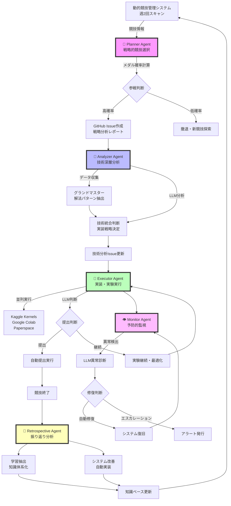

# Kaggle Claude Mother

**🏆 Kaggleメダル獲得自動化システム** - LLM強化エージェントによる戦略的競技参戦・技術実装・メダル獲得最適化システム

グランドマスター級戦略をシステム化し、競技選択から技術実装まで全自動でメダル獲得を目指します。

## 🤖 5エージェント自動システム

| エージェント | 主要機能 | 処理方式 |
|-------------|---------|---------|
| **🎯 Planner** | 戦略的競技選択・メダル確率算出 | **ルールベース** - 数値計算・確率モデル |
| **🧠 Analyzer** | 技術分析・グランドマスター解法調査 | **ハイブリッド** - データ収集(ルール) + 技術統合(LLM) |
| **🚀 Executor** | クラウド実行・モデル実装・提出 | **ハイブリッド** - 実行制御(ルール) + 提出判断(LLM) |
| **👁️ Monitor** | システム監視・異常検出・自動修復 | **ハイブリッド** - 監視・修復(ルール) + 異常診断(LLM) |
| **🔄 Retrospective** | 競技終了後分析・システム改善 | **ルールベース** - パフォーマンス分析・改善提案 |

## ⚡ エージェント処理方式詳細

各エージェントの処理方式（ルールベース vs LLM）の使い分けを詳細化：

| エージェント | 主要機能 | ルールベース処理 | LLM処理 | 使用プロンプト |
|-------------|---------|-----------------|---------|-------------|
| **🎯 Planner** | 戦略的競技選択<br>メダル確率算出 | • メダル確率計算・数値モデル<br>• 競技スキャン・選択戦略<br>• ポートフォリオ最適化<br>• 撤退判断・GitHub Issue操作 | なし<br>（純数値計算で効率重視） | - |
| **🧠 Analyzer** | 技術分析<br>グランドマスター解法調査 | • グランドマスターパターン分析<br>• 実装可能性評価<br>• Kaggle解法収集<br>• 論文収集・データ整理 | • 技術統合判断<br>（`_llm_based_integration`）<br>• 複雑な技術選択決定<br>• 統合戦略立案 | `analyzer_technical_analysis.md` |
| **🚀 Executor** | クラウド実行<br>モデル実装・提出 | • クラウド実行管理<br>• リソース最適化<br>• コード生成・並列実行<br>• 汎用競技提出処理 | • 提出判断<br>（`SubmissionDecisionAgent`）<br>• 継続実験判断<br>• 実験戦略調整 | `executor_submission_decision.md` |
| **👁️ Monitor** | システム監視<br>異常検出・自動修復 | • メトリクス収集・健全性評価<br>• アラート処理・自動修復<br>• 監視レポート生成<br>• サービス監視・システム修復 | • 異常診断<br>（`_perform_llm_anomaly_diagnosis`）<br>• 複雑な異常パターン解析<br>• 対策提案・原因特定 | `monitor_anomaly_diagnosis.md` |
| **🔄 Retrospective** | 競技終了後分析<br>システム改善 | • パフォーマンス分析<br>• 改善提案・システム更新<br>• 統計的評価・最適化提案 | なし<br>（数値分析で十分） | - |

## 🚀 自動実行フロー

システムは完全自動でメダル獲得まで実行されます：



### 1. 競技選択・参戦（Planner）
- 週2回の動的競技スキャン（火・金 7:00）
- メダル確率算出・最適3競技選択
- 低確率競技からの自動撤退・新競技参戦

### 2. 技術分析・戦略策定（Analyzer）
- グランドマスター解法調査・技術統合判断（LLM活用）
- 実装可能性評価・優先度決定
- Executor向け技術実装指示生成

### 3. 実装・実験・提出（Executor）
- 複数クラウド環境での並列実験実行
- 提出タイミング判断（LLM活用）・自動提出
- 継続実験・戦略調整

### 4. 監視・修復・最適化（Monitor）
- リアルタイム監視・異常検出（LLM診断活用）
- 自動修復・システム復旧
- パフォーマンス最適化提案

### 5. 競技終了後分析・改善（Retrospective）
- 結果分析・失敗要因特定
- システム改善提案・マザーリポジトリ更新
- 次競技への知識転移

## 📁 プロジェクト構造

```
kaggle-claude-mother/                 # 統合マザーリポジトリ
├── system/                           # エージェントシステム
│   ├── agents/                       # 5エージェント実装
│   │   ├── planner/                  # 🎯 戦略プランニング
│   │   ├── analyzer/                 # 🧠 深層技術分析
│   │   ├── executor/                 # 🚀 高度実行
│   │   ├── monitor/                  # 👁️ システム監視
│   │   └── retrospective/            # 🔄 反省・改善
│   └── prompts/                      # LLMプロンプト管理
│       ├── analyzer_technical_analysis.md
│       ├── monitor_anomaly_diagnosis.md
│       └── executor_submission_decision.md
├── competitions/                     # 競技別独立環境
│   ├── {competition-name}/          # 各競技専用ディレクトリ
│   │   ├── .venv/                   # 独立Python環境
│   │   ├── notebooks/               # 実験ノートブック
│   │   ├── models/                  # 訓練済みモデル
│   │   └── data/                    # 競技データ
└── plan_*.md                        # 各エージェント詳細仕様

## ⚙️ セットアップ・実行

### 初回設定（一回限り）

```bash
# 1. 認証設定
mkdir -p ~/.kaggle
cp kaggle.json ~/.kaggle/
chmod 600 ~/.kaggle/kaggle.json
gh auth login

# 2. システム依存関係インストール
uv sync
```

### 実行方法

#### 🏆 推奨: systemd service化（24/7自動運用）
```bash
# service設定・開始
sudo tee /etc/systemd/system/kaggle-claude-mother.service > /dev/null <<EOF
[Unit]
Description=Kaggle Claude Mother - Autonomous Medal System
After=network.target

[Service]
Type=simple
User=$USER
WorkingDirectory=$(pwd)
ExecStart=$(which uv) run python main.py --mode autonomous
Restart=always
RestartSec=30

[Install]
WantedBy=multi-user.target
EOF

sudo systemctl daemon-reload
sudo systemctl enable kaggle-claude-mother
sudo systemctl start kaggle-claude-mother
```

#### 🥈 代替: バックグラウンド実行
```bash
nohup uv run python main.py --mode autonomous > logs/system.log 2>&1 &
```

### 監視・管理
```bash
# システム状態確認
./service-control.sh status

# ログ確認
./service-control.sh logs

# GitHub Issueで進捗確認
gh issue list --label monitor
```

## 🧪 テスト実行

```bash
# LLM強化エージェントテスト
uv run python test_llm_enhanced_agents.py

# システム統合テスト
uv run python test_system_integration.py

# 提出判断テスト
uv run python test_llm_submission_decision.py
```

**注意**: 
- GitHub認証は`gh auth token`コマンドで自動取得（環境変数`GITHUB_TOKEN`もフォールバック対応）
- LLMモデルは`--model sonnet`相当の最新Sonnetを自動使用

## 🔧 systemdサービス

ユーザー空間のsystemdサービスとして実行。メインサービス起動時に監視タイマーも自動開始。

```bash
./service-control.sh start   # サービス開始（監視も自動開始）
./service-control.sh stop    # サービス停止
./service-control.sh status  # 状態確認
./service-control.sh logs    # ログ表示
./service-control.sh enable  # 自動起動有効化
```

**監視機能**: 5分ごとに健全性チェック・エラー検出・自動修復を実行

## 📋 詳細仕様・実装計画

各エージェントの詳細仕様と実装計画は専用ドキュメントを参照：

### 🤖 エージェント実装仕様
- [🎯 Planner Agent](plan_planner.md) - 戦略的競技選択・メダル確率算出・撤退判断
- [🧠 Analyzer Agent](plan_analyzer.md) - 技術分析・グランドマスター解法調査・LLM統合判断
- [🚀 Executor Agent](plan_executor.md) - クラウド実行・モデル実装・LLM提出判断
- [👁️ Monitor Agent](plan_monitor.md) - システム監視・LLM異常診断・自動修復
- [🔄 Retrospective Agent](plan_retrospective.md) - 競技終了後分析・システム改善

### 🏗️ システム基盤仕様
- [動的競技管理システム](plan_dynamic_competition_manager.md) - 週2回最適化・3競技並行管理
- [Issue安全連携システム](plan_issue_safety_system.md) - GitHub Issue原子性操作・競合回避

### 🧠 LLMプロンプト管理
- `system/prompts/analyzer_technical_analysis.md` - Analyzer技術統合判断
- `system/prompts/monitor_anomaly_diagnosis.md` - Monitor異常診断
- `system/prompts/executor_submission_decision.md` - Executor提出判断
- **モデル指定**: Claude Code実行時は `--model sonnet` オプションで最新のClaude Sonnetを使用
  ```bash
  claude code --model sonnet "技術統合判断を実行"
  ```

## 🏆 システム特徴

### ✅ 完全自動化
- **初回認証のみ**: Kaggle・GitHub API認証後は人間介入不要
- **24/7自動運用**: systemdサービス化による継続実行
- **自動修復**: エラー検出・依存関係修復・サービス再起動

### ✅ LLM強化による高度判断
- **技術統合判断**: 複雑な技術選択にAnalyzer LLM活用
- **提出タイミング**: Executor LLM判断による最適提出
- **異常診断**: Monitor LLM診断による根本原因特定

### ✅ 効率的リソース活用
- **無料クラウド**: Kaggle Kernels・Google Colab・Paperspace活用
- **並列実行**: 最大3競技同時進行でメダル獲得機会最大化
- **動的最適化**: 週2回の競技入れ替えによる効率追求

---

**🎯 メダル獲得目標**: Gold・Silver・Bronze獲得による段階的グランドマスター到達
**⚡ 想定成功率**: 80-85% (無料リソース制約下での最適化後確率)