# Kaggle Claude Mother

**🏆 Kaggleメダル獲得最優先** のためのグランドマスター級攻略システム。Claude Codeを活用し、戦略的コンペ選択から高度技術実装まで、メダル獲得に必要な全要素を統合した戦略的マザーリポジトリです。

グランドマスター事例（Owen Zhang、Abhishek Thakur等）の成功要因を分析し、**「金メダル1個 > 銀メダル2個」**の原則に基づく戦略的アプローチを実装。平均2年かかるグランドマスター到達を大幅短縮することを目標とします。

## 🎯 メダル獲得戦略の核心

- **🔍 戦略的コンペ選択**: メダル獲得確率の定量評価による最適選択
- **🧠 グランドマスター級技術**: cuML/GPU最適化アンサンブル・スタッキング
- **📚 継続学習システム**: 失敗分析→知識蓄積→次戦略最適化
- **⚡ 統合エージェント連携**: 4エージェントによる同時並行・継続フロー

## 🤖 自動化メダル獲得システム

### 自動実行アーキテクチャ概要
システムは**人間介入を最小化**し、自律的にメダル獲得に向けて動作します。実装手段（shell/Python/GitHub Actions等）は要検討、設計思想が核心です。

### Stage 1: 動的コンペ管理・最適化参戦（最大3コンペ同時進行）
```yaml
# 週2回の動的最適化実行
dynamic_competition_manager:
  trigger: schedule(tuesday_7am, friday_7am)  # 週2回の最適化チェック
  process:
    - scan_active_competitions()
    - calculate_medal_probability(participants, prize, domain_match)
    - compare_with_current_competitions(running_competitions)
    - identify_optimal_portfolio(max_concurrent: 3)
    
    # 動的入れ替えロジック
    - if_better_opportunity_found():
        - rank_all_competitions_by_probability()
        - trigger_withdrawal_process(lowest_probability_competition)
        - auto_initialize_new_competition_workspace()
        - transfer_cross_competition_learnings()
    
    - maintain_top3_competitions(threshold_score > 0.7)
    - trigger_independent_agent_flow_per_competition()
```

### Stage 2-3: 各コンペ独立エージェント実行
```yaml
# 各コンペごとに独立したエージェント連携（最大3コンペ並行）
per_competition_orchestration:
  competition_instance: "{competition_name}"
  working_directory: "competitions/{competition_name}/"
  
  planner_agent:
    trigger: competition_selected
    scope: single_competition
    execution_context: "cd competitions/{competition_name}"
    auto_actions:
      - create_strategy_issue(competition_specific)
      - analyze_medal_probability(independent)
      - notify_analyzer_agent(same_competition)
      
  analyzer_agent:
    trigger: strategy_issue_created
    scope: single_competition
    execution_context: "cd competitions/{competition_name}"
    auto_actions:
      - deep_dive_grandmaster_solutions(competition_focused)
      - research_latest_techniques(domain_specific)
      - update_technical_feasibility(isolated)
      - notify_executor_agent(same_competition)
      
  executor_agent:
    trigger: analysis_completed
    scope: single_competition
    execution_context: "cd competitions/{competition_name}"
    auto_actions:
      - setup_cuml_gpu_environment(dedicated_resources)
      - implement_owen_zhang_methods(competition_tailored)
      - run_parallel_experiments(isolated_workspace)
      - report_scores_realtime(competition_specific)
      
  monitor_agent:
    trigger: continuous
    scope: single_competition
    execution_context: "cd competitions/{competition_name}"
    auto_actions:
      - analyze_experiment_failures(competition_focused)
      - accumulate_knowledge_base(cross_competition_learning)
      - optimize_strategy_realtime(independent_optimization)

# 動的撤退・入れ替えプロセス
dynamic_replacement_system:
  trigger: better_opportunity_identified_by_stage1
  
  withdrawal_orchestration:
    target_competition: lowest_medal_probability
    auto_actions:
      - analyze_current_standing(final_medal_probability_assessment)
      - execute_graceful_withdrawal(save_experiment_logs, extract_key_learnings)
      - trigger_retrospective_agent(competition_specific_analysis)
      - clean_allocated_resources(gpu_memory, workspace, dependencies)
      - notify_portfolio_rebalancing(competition_slot_available)
      
  replacement_orchestration:
    new_competition: highest_available_probability
    auto_actions:
      - initialize_new_competition_workspace(dedicated_setup)
      - transfer_applicable_knowledge(cross_competition_patterns)
      - start_independent_agent_flow(planner→analyzer→executor→monitor)
      - integrate_portfolio_monitoring(unified_tracking)
```

### Stage 4: 自動学習・次戦略最適化
```yaml
# 継続改善自動サイクル  
continuous_learning:
  trigger: competition_ended_or_withdrawal
  auto_process:
    - analyze_medal_result(success/failure/withdrawal)
    - extract_success_failure_patterns()
    - update_probability_calculation_model()
    - optimize_next_competition_selection()
    - trigger_retrospective_agent()
    - auto_start_next_cycle()
```

### Stage 5: システム自己改善【反省エージェント】
```yaml
# マザーリポジトリ自動改善
retrospective_agent:
  trigger: competition_ended_or_withdrawal_decision
  
  issue_creation_spec:
    title_format: "System Improvement Request: [Analysis Type] - [Competition/System]"
    labels:
      - "agent:retrospective"
      - "priority:system-improvement"
      - "status:analysis-complete"
      - "type:[performance|bottleneck|strategy|technical]"
    
    body_structure:
      analysis_results:
        - competition_context: "コンペ名・期間・最終順位・メダル結果"
        - performance_metrics: "CV/LBスコア・処理時間・GPU使用率・メモリ効率"
        - bottleneck_identification: "特定されたボトルネック・エラー・非効率箇所"
        
      root_cause_analysis:
        - technical_issues: "技術的問題・ライブラリ・コード品質・最適化不足"
        - strategy_issues: "戦略判断・コンペ選択・撤退タイミング・確率算出"
        - coordination_issues: "エージェント連携・Issue管理・フロー効率性"
        
      improvement_proposals:
        - code_changes: "具体的コード修正案・ファイルパス・実装詳細"
        - strategy_updates: "戦略アルゴリズム改善・確率モデル調整"
        - system_enhancements: "エージェント連携・自動化フロー最適化"
        - template_improvements: "テンプレート・コマンド・設定ファイル改良"
        
      implementation_priority:
        - critical: "メダル獲得に直結・即座対応必要"
        - high: "効率大幅改善・次コンペ前実装推奨"
        - medium: "長期的改善・余裕時実装"
        
  auto_actions:
    - analyze_competition_results(medal_outcome, performance_data)
    - identify_system_bottlenecks(agent_coordination, technical_stack)
    - evaluate_strategy_effectiveness(probability_accuracy, selection_success)
    - create_structured_improvement_issue(with_labels_and_detailed_body)
    - notify_self_improvement_agent(issue_created)

# 自己改善実行エージェント
self_improvement_agent:
  trigger: retrospective_issue_created
  
  issue_processing:
    target_labels: ["agent:retrospective", "status:analysis-complete"]
    priority_handling:
      - critical: immediate_implementation
      - high: schedule_within_24h
      - medium: queue_for_maintenance_window
      
  implementation_workflow:
    code_improvement:
      - review_proposed_changes(file_paths, implementation_details)
      - create_feature_branch(improvement-{issue_number})
      - implement_code_changes(templates, commands, coordination_logic)
      - run_automated_tests(validation, regression_check)
      - update_documentation(README, command_specs)
      
    strategy_optimization:
      - update_probability_models(medal_calculation_algorithms)
      - refine_competition_selection_logic(scoring_weights)
      - optimize_withdrawal_thresholds(timing_parameters)
      - enhance_portfolio_balancing(resource_allocation)
      
    system_enhancement:
      - improve_agent_coordination(issue_management, notification_flow)
      - optimize_automation_triggers(schedule, condition_logic)
      - enhance_monitoring_capabilities(performance_tracking)
      - update_error_handling(retry_logic, fallback_mechanisms)
      
  completion_workflow:
    validation:
      - verify_implementation_completeness(all_proposed_changes)
      - test_system_functionality(end_to_end_validation)
      - measure_performance_impact(before_after_comparison)
      
    issue_closure:
      - add_completion_comment(implementation_summary, validation_results)
      - update_issue_labels(status:completed, resolved:success)
      - close_issue_with_summary(changes_applied, performance_impact)
      - merge_improvement_branch(after_validation_success)
      
  auto_actions:
    - monitor_retrospective_issues(continuous_scanning)
    - prioritize_by_medal_impact(critical_path_analysis)
    - implement_approved_changes(automated_execution)
    - validate_improvements(testing_and_verification)
    - close_issues_with_detailed_summary(completion_tracking)
```

### 人間介入ポイント（初回認証のみ）
- **認証設定**: 初回のKaggle・GitHub API認証のみ
- **以降完全自動**: システム起動から戦略判断・撤退決定・システム改善まで全自動化

## 📁 シングルリポジトリ構造

### ディレクトリ構造
```
kaggle-claude-mother/                 # 統合マザーリポジトリ
├── templates/                        # コンペ用テンプレート
│   ├── notebooks/                    # 分析ノートブック雛形
│   └── pyproject.toml.template       # uv設定テンプレート
├── competitions/                     # 全コンペ統合管理
│   ├── titanic/                      # コンペ別独立環境
│   │   ├── pyproject.toml            # コンペ専用uv環境
│   │   ├── .venv/                    # 独立仮想環境
│   │   ├── notebooks/
│   │   │   └── submission.ipynb     # 提出用統合ノートブック
│   │   ├── data/                     # コンペ固有データ
│   │   ├── models/                   # 訓練済みモデル・重み
│   │   ├── experiments/              # 実験ログ・結果
│   │   ├── insights/
│   │   │   └── discussion_summary.md # 抽出知見
│   │   └── cache/
│   │       └── discussions/          # Discussion分析キャッシュ
│   ├── house-prices/                 # 他コンペも同様構造
│   └── nlp-disaster/
└── system/                           # システム自動化スクリプト
    ├── agents/                       # エージェント実行スクリプト
    ├── automation/                   # 自動化処理
    └── monitoring/                   # システム監視
```

### データ・コード配置方針
- **🎯 完全分離**: 各コンペのデータ・モデル・コード・実験結果は全て`competitions/[comp-name]/`内に配置
- **🔒 環境独立**: コンペごとに独立したuv仮想環境（`.venv/`）で依存関係を完全分離
- **📊 全体把握**: 単一リポジトリ内でのIssue管理により、全コンペの進捗・状況を一元監視
- **⚡ リソース効率**: GitHubリポジトリ乱立防止、統合的なCI/CD・自動化システム構築

## 🚀 完全自動化セットアップ

**人間の作業は初回認証のみ** - 以降は全自動でメダル獲得まで動作します。

### 一回限りの初期設定
```bash
# 1. 認証設定（一回のみ）
mkdir -p ~/.kaggle
cp kaggle.json ~/.kaggle/  # Kaggle API認証
chmod 600 ~/.kaggle/kaggle.json
gh auth login  # GitHub API認証（Issue操作用）

# 2. 自動化システム起動
./start_autonomous_system.sh  # 完全自動化開始
```

### 完全自動動作開始後（週2回動的最適化・最大3コンペ並行）
システムが以下を**人間介入なし**で実行：
- ✅ **週2回（火・金）動的コンペスキャン**・メダル確率再評価・最適3コンペ維持
- ✅ **自動入れ替え**：より良いコンペ発見時の下位コンペ撤退・新コンペ参戦
- ✅ 各コンペ独立の自動環境構築（uv + cuML/GPU + 専用ライブラリ）
- ✅ コンペ特化グランドマスター解法調査・独立実装・並行実験・個別提出
- ✅ コンペ個別失敗学習・横断知識共有・独立戦略最適化・統合システム改善
- ✅ **動的撤退**：メダル圏外確定 or より良い機会発見時の即座撤退・反省
- ✅ 成功時の知識蓄積・全コンペ横断学習・次戦略向上

**人間は結果通知を受けるのみ** - システムが常に最高確率3コンペで自律的にメダル獲得を目指します。

## 提出方式

**単一ノートブック提出**が標準的な方式です。Kaggleコンペでは1つのノートブックで全ての処理（EDA、前処理、モデリング、予測）を完結させます。

```bash
# 各コンペディレクトリに移動して実行
cd competitions/competition-name
uv run kaggle kernels push -p ./notebooks/submission.ipynb
```

**重要**: 全ての作業（データ分析、モデル訓練、提出）は対応するコンペディレクトリ内で実行してください。

## 共通コードブロック

再利用可能なコードブロックは`templates/`ディレクトリに配置され、新しいコンペ作成時に各コンペディレクトリにコピーされます。

## 🤖 エージェント間連携システム

シングルリポジトリ内での**GitHub Issue API**による安全な自動連携システム。各コンペを完全独立実行しながら、統合的な進捗管理を実現します。

### 5エージェント構成と役割

#### 1. 戦略プランニングエージェント (`agent:planner`)
**🎯 メダル確率算出・戦略的コンペ選択・撤退判断**
- メダル獲得確率の定量算出（参加者数×賞金×専門性マッチング）
- 「金メダル1個>銀メダル2個」原則による最適コンペ選択
- 中間順位分析による自動撤退判断（メダル圏外確定時）

#### 2. 深層分析エージェント (`agent:analyzer`)
**🔬 グランドマスター級技術調査・最新手法研究**
- Owen Zhang/Abhishek Thakur級解法の技術分析・再現性評価
- arXiv論文+Kaggle優勝解法の自動収集・実装可能性判定
- 手法別性能ベンチマーク・GPU最適化要件分析

#### 3. 高度実行エージェント (`agent:executor`)
**🏗️ GPU最適化実装・高速実験・並列実行**
- cuML/GPU大規模アンサンブル・スタッキングの並列実行
- Owen Zhang式手動特徴量エンジニアリング+自動化ハイブリッド
- 複数モデル同時並行訓練・リアルタイムスコア監視

#### 4. 学習モニタリングエージェント (`agent:monitor`)
**🧠 継続学習・失敗分析・動的最適化**
- 実験失敗・スコア低下の要因構造化分析
- 成功・失敗パターンのデータベース化・コンペ横断転移学習
- 中間結果に基づく戦略・手法のリアルタイム調整

#### 5. 反省エージェント (`agent:retrospective`)
**🔧 システム自己改善・マザーリポジトリ自動更新**
- エージェント連携・コード・戦略アルゴリズムの最適化
- 確率算出モデル・技術選択・タイミング判断の精度向上
- templates/・system/・連携ロジックの改良実装

### Issue安全連携システム（コンペ取り違い防止）

#### 厳密なラベルシステム
```yaml
# 必須ラベル組み合わせ（全Issue一意識別）
issue_identification:
  agent_type: ["agent:planner", "agent:analyzer", "agent:executor", "agent:monitor", "agent:retrospective"]
  competition: ["comp:titanic", "comp:house-prices", "comp:nlp-disaster"]  # コンペ名で識別
  status: ["status:auto-processing", "status:waiting", "status:completed"]
  priority: ["priority:medal-critical", "priority:optimization", "medal-probability:high/medium/low"]

# Issue作成フォーマット
issue_format:
  title: "[{comp-name}] {agent}: {task_description}"
  example: "[titanic] planner: Medal Probability Analysis - 1247 participants"
  required_labels: ["agent:{type}", "comp:{name}", "status:auto-processing", "priority:{level}"]
```

#### 安全な自動連携フロー
```yaml
# エージェント反応条件（厳密フィルタリング）
agent_triggers:
  planner: "comp:{target} AND agent:system"
  analyzer: "comp:{target} AND agent:planner AND status:completed"
  executor: "comp:{target} AND agent:analyzer AND status:completed"  
  monitor: "comp:{target} AND agent:executor"
  retrospective: "comp:{target} AND (status:completed OR status:error)"

# 実行環境分離
execution_isolation:
  working_directory: "cd competitions/{comp-name}/"
  environment: "source competitions/{comp-name}/.venv/bin/activate"
  issue_filter: "必須：comp:{target}ラベルでの厳密な絞り込み"
```

### 完全自動連携フロー（各コンペ独立実行）

#### 🔄 システム全体アーキテクチャ（シングルリポジトリ + Issue安全連携）

```mermaid
graph TB
    %% 動的管理層
    subgraph "🎯 Dynamic Competition Management"
        A[週2回スキャン<br/>火・金 7:00] --> B{確率再評価}
        B --> C{最適3コンペ維持}
        C -->|入れ替え| D[撤退→新参戦]
        C -->|維持| E[継続実行]
    end
    
    %% Issue安全システム
    subgraph "🔒 Issue Safety System"
        F[GitHub Issue API<br/>統合連携ハブ]
        G[厳密ラベリング<br/>comp:名前 + agent:種別]
        H[環境分離<br/>cd competitions/comp/]
    end
    
    %% 各コンペ独立実行（最大3並行）
    subgraph "🏁 Competition A (competitions/comp-a/)"
        I1[comp:comp-a<br/>🎯 Planner] --> J1[comp:comp-a<br/>🔬 Analyzer]
        J1 --> K1[comp:comp-a<br/>🏗️ Executor]
        K1 --> L1[comp:comp-a<br/>🧠 Monitor]
    end
    
    subgraph "🏁 Competition B (competitions/comp-b/)"
        I2[comp:comp-b<br/>🎯 Planner] --> J2[comp:comp-b<br/>🔬 Analyzer]
        J2 --> K2[comp:comp-b<br/>🏗️ Executor] 
        K2 --> L2[comp:comp-b<br/>🧠 Monitor]
    end
    
    subgraph "🏁 Competition C (competitions/comp-c/)"
        I3[comp:comp-c<br/>🎯 Planner] --> J3[comp:comp-c<br/>🔬 Analyzer]
        J3 --> K3[comp:comp-c<br/>🏗️ Executor]
        K3 --> L3[comp:comp-c<br/>🧠 Monitor]
    end
    
    %% 統合学習・改善
    subgraph "🔧 System Self-Improvement"
        M[🔧 Retrospective Agent<br/>横断分析・改善提案]
        N[マザーリポジトリ<br/>自動更新・最適化]
    end
    
    %% フロー接続
    D --> F
    E --> F
    F --> I1 & I2 & I3
    
    L1 --> M
    L2 --> M  
    L3 --> M
    
    M --> N
    N --> A
    
    %% Issue安全システム接続
    F -.-> G
    G -.-> H
    H -.-> I1 & I2 & I3
    
    %% スタイリング
    classDef mgmt fill:#e1f5fe
    classDef safety fill:#fff3e0  
    classDef compA fill:#f3e5f5
    classDef compB fill:#e8f5e8
    classDef compC fill:#fff8e1
    classDef improve fill:#fce4ec
    
    class A,B,C,D,E mgmt
    class F,G,H safety
    class I1,J1,K1,L1 compA
    class I2,J2,K2,L2 compB
    class I3,J3,K3,L3 compC
    class M,N improve
```



#### 📋 コンペ別実行ステップ
```yaml
# 各コンペで独立並行実行される自動フロー
execution_flow:
  1_system_scan:
    trigger: "週2回（火・金 7:00）"
    action: "全コンペ確率算出→最適3コンペ選択→動的入れ替え判断"
    
  2_planner:
    issue: "[{comp}] planner: Medal Strategy Analysis"
    context: "cd competitions/{comp}/"
    action: "コンペ別戦略策定・確率算出→analyzer起動"
    
  3_analyzer: 
    issue: "[{comp}] analyzer: Technical Research"  
    context: "cd competitions/{comp}/"
    action: "グランドマスター解法調査・実装判断→executor起動"
    
  4_executor:
    issue: "[{comp}] executor: GPU Implementation"
    context: "cd competitions/{comp}/ && source .venv/bin/activate"
    action: "cuML実装・並列実験・スコア監視→monitor起動"
    
  5_monitor:
    issue: "[{comp}] monitor: Performance Tracking"
    context: "cd competitions/{comp}/"
    action: "継続監視・失敗学習・動的最適化→retrospective起動"

# 安全性保証メカニズム
safety_guarantees:
  issue_isolation: "comp:{target}ラベルでの厳密コンペ識別"
  environment_isolation: "competitions/{comp}/での独立uv環境"
  cross_competition_prevention: "他コンペIssueへの誤反応完全防止"
```